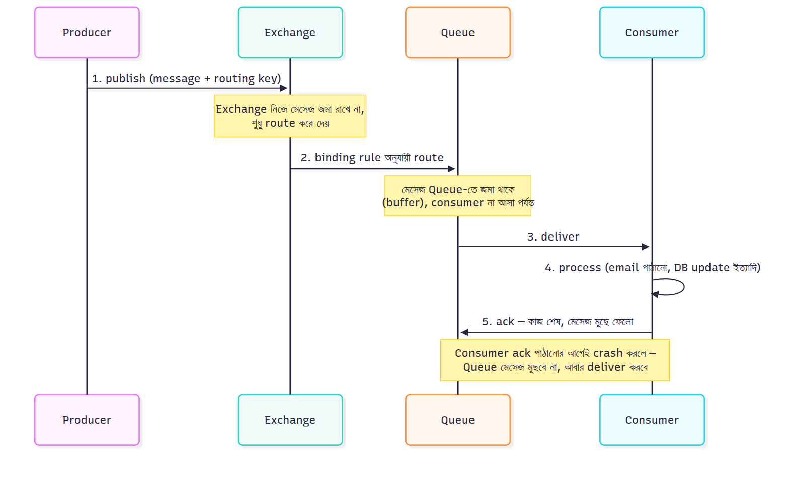

# কীভাবে কাজ করে — Flow

এই ছবিতে পুরো flow টা দেখা যাচ্ছে। এখন ধাপে ধাপে ব্যাখ্যা করি:

### ১. Producer
আপনার অ্যাপ্লিকেশন (যেমন একটা API server) একটা মেসেজ তৈরি করে RabbitMQ-তে পাঠায়। এই কাজটা সাথে সাথে হয়ে যায় — producer কোনো response wait করে না।

### ২. Exchange
মেসেজটা সরাসরি Queue-তে যায় না, প্রথমে **Exchange**-এ যায়। Exchange-এর কাজ হলো ঠিক করা মেসেজটা কোন Queue-তে পাঠানো হবে — এটা routing key বা binding rule অনুযায়ী ঠিক হয় (আগের মেসেজে যে Direct/Fanout/Topic exchange বলেছিলাম, সেটার কাজ এখানেই)।

### ৩. Queue
মেসেজটা Queue-তে জমা থাকে (buffer এর মতো) — যতক্ষণ না কোনো Consumer সেটা নিয়ে যায়। এখানেই মূল ফায়দাটা — Consumer এই মুহূর্তে ব্যস্ত থাকলে বা ডাউন থাকলেও মেসেজ হারায় না, Queue-তে অপেক্ষা করে।

### ৪. Consumer
একটা worker process Queue থেকে মেসেজ নিয়ে প্রসেস করে (যেমন email পাঠানো, database update করা)।

### ৫. Acknowledgement (Ack)
এটাই সবচেয়ে গুরুত্বপূর্ণ part। Consumer কাজ শেষ করার পর RabbitMQ-কে "ack" (acknowledgement) পাঠায়। তখনই RabbitMQ মেসেজটা Queue থেকে permanently ডিলিট করে।

**যদি Consumer কাজ করার আগেই crash করে** — ack পাঠানো হয় না, তাই RabbitMQ মেসেজটা মুছে ফেলে না, বরং সেটা আবার Queue-তে ফিরিয়ে দেয় (বা অন্য কোনো Consumer-কে দেয়)। এভাবে **guaranteed delivery** নিশ্চিত হয় — মেসেজ হারানোর কোনো সুযোগ নেই।

এই জন্যই Food delivery বা E-commerce এর example এ বলেছিলাম — একটা service crash করলেও ডেটা হারায় না, শুধু delay হয়।

---

---

[⬅ 02-Why-RabbitMQ.md](./02-Why-RabbitMQ.md) | [04-Internals.md ➡](./04-Internals.md) | [🏠 Repo Home](../README.md)
