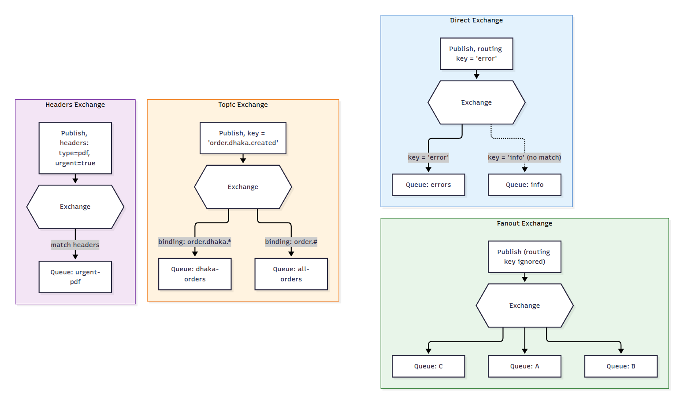

# ভেতরের মেকানিজম — Internals

আরও গভীরে যাই, একটা একটা করে RabbitMQ-এর ভেতরের মেকানিজম বুঝিয়ে দিচ্ছি।

### Connection আর Channel — পার্থক্য কী

- **Connection**: আপনার অ্যাপ্লিকেশন আর RabbitMQ সার্ভারের মধ্যে একটা TCP connection। এটা তৈরি করা costly (resource-heavy)।
- **Channel**: একটা Connection-এর ভেতরে অনেকগুলো "virtual" চ্যানেল তৈরি করা যায়। প্রতিটা কাজ (publish, consume) একটা Channel দিয়ে হয়।

**কেন দরকার?** প্রতিটা মেসেজ পাঠানোর জন্য নতুন TCP connection বানালে সিস্টেম স্লো হয়ে যাবে। তাই একটা Connection খুলে তার ভেতরে অনেক Channel দিয়ে multiple কাজ parallel-এ চালানো হয় — হালকা এবং দ্রুত।

### Exchange Types — বিস্তারিত

চার ধরনের Exchange হয় — **Direct, Fanout, Topic, Headers** — প্রতিটার নিজস্ব routing behavior ও use case আছে:

| Type | কাজ | Use case |
|---|---|---|
| **Direct** | routing key হুবহু ম্যাচ করে যে queue-তে পাঠায় | নির্দিষ্ট queue-তে মেসেজ পাঠানো |
| **Fanout** | সব bound queue-তে broadcast করে | সব consumer-কে একই মেসেজ পাঠানো |
| **Topic** | pattern (wildcard) দিয়ে routing key ম্যাচ করে | category-ভিত্তিক routing |
| **Headers** | message header দিয়ে routing করে | header-based complex routing |

### Reliability / Durability — মেসেজ কীভাবে হারায় না

তিনটা জিনিস একসাথে configure করতে হয়, নাহলে RabbitMQ সার্ভার রিস্টার্ট হলে বা crash করলে মেসেজ হারিয়ে যাবে:

1. **Durable Queue** — Queue declare করার সময় `durable: true` সেট করতে হয়, নাহলে সার্ভার রিস্টার্ট হলে Queue-টাই উধাও হয়ে যাবে।
2. **Persistent Message** — মেসেজ পাঠানোর সময় `delivery_mode: 2` সেট করলে মেসেজ disk-এ লেখা হয় (শুধু RAM-এ না)।
3. **Publisher Confirm** — Producer কে জানানো হয় যে RabbitMQ মেসেজটা সত্যিই receive করেছে, নাহলে producer ভাববে মেসেজ গেছে কিন্তু আসলে যায়নি।

### Ack — Manual vs Automatic

- **Auto ack**: মেসেজ Consumer-কে দেওয়া মাত্রই RabbitMQ ধরে নেয় কাজ শেষ, মুছে ফেলে। **সমস্যা**: Consumer যদি মেসেজ পাওয়ার পরই crash করে, মেসেজ হারিয়ে যায়।
- **Manual ack**: Consumer কাজ শেষ করার পর explicitly `ack()` কল করে। এটাই production-এ recommended, কারণ কাজ পুরোপুরি সম্পন্ন না হওয়া পর্যন্ত RabbitMQ মেসেজ ধরে রাখে।

### Prefetch Count — কেন গুরুত্বপূর্ণ

ধরুন একটা Queue-তে ১০০০০ মেসেজ আছে, আর একটা Consumer আছে। Prefetch সেট না করলে RabbitMQ সব মেসেজ একসাথে consumer-কে পাঠিয়ে দেবে — consumer এর memory overflow হবে। `prefetch_count: 10` সেট করলে consumer একসাথে সর্বোচ্চ ১০টা মেসেজ নিয়ে কাজ করবে, একটার ack দিলে পরের একটা আসবে। এভাবে **load evenly distribute** হয় multiple consumer এর মধ্যে।

### Dead Letter Queue (DLQ)

একটা মেসেজ যদি বারবার প্রসেস করতে গিয়ে fail করে (exception throw করে), তাহলে সেটা infinite loop-এ আটকে যেতে পারে। DLQ হলো একটা আলাদা "reject/expired মেসেজের জন্য" Queue। যখন কোনো মেসেজ:
- Consumer explicitly reject করে (`nack` with requeue=false)
- একটা নির্দিষ্ট সময় (TTL) পার হয়ে যায়
- Queue এর সর্বোচ্চ length ছাড়িয়ে যায়

তখন সেটা মূল Queue থেকে সরে গিয়ে DLQ-তে চলে যায়, যাতে পরে manually inspect করা যায় কেন fail হয়েছিল — মূল Queue আটকে না থেকে।

---

---

[⬅ 03-How-It-Works-Flow.md](./03-How-It-Works-Flow.md) | [05-Message-Ordering.md ➡](./05-Message-Ordering.md) | [🏠 Repo Home](../README.md)
