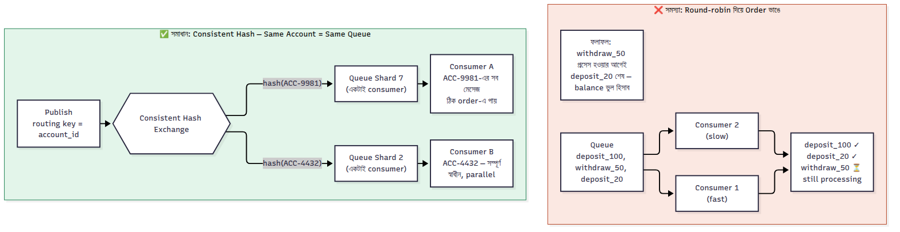

# Message Ordering — বিস্তারিত

আরও বিস্তারিতভাবে বুঝিয়ে দিচ্ছি এই order guarantee ব্যাপারটা।

### ৫.১ কেন Multiple Consumer থাকলে Order ভেঙে যায়

ধরুন একটা Queue-তে ৩টা মেসেজ আছে account "A" এর জন্য: `deposit_100`, `withdraw_50`, `deposit_20` — এই order-এই আসছে।

যদি ২টা Consumer (C1, C2) থাকে RabbitMQ **round-robin** ভাবে মেসেজ ভাগ করে দেয়:
- `deposit_100` → C1
- `withdraw_50` → C2
- `deposit_20` → C1

এখন C2 যদি slow হয় (নেটওয়ার্ক লেটেন্সি, বা heavy computation), তাহলে C1 তার দুটো মেসেজ (`deposit_100`, `deposit_20`) আগেই শেষ করে ফেলতে পারে, কিন্তু `withdraw_50` তখনও process হয়নি। ফলে balance calculation-এ ভুল হয়ে যাবে — কারণ **processing order আর queue order এক থাকছে না**।

### ৫.২ সমাধান ১: Routing Key দিয়ে Same Account = Same Queue

এখানে মূল কৌশল হলো — একই account-এর সব মেসেজ **যেন সবসময় একই Queue-তে যায়**, এবং সেই Queue-এর সাথে **একটাই Consumer** bind করা থাকে।

কীভাবে করা হয়:
- Producer মেসেজ পাঠানোর সময় routing key হিসেবে `account_id` ব্যবহার করে (যেমন routing key = `"account_12345"`)
- **Consistent Hashing Exchange** (এটা RabbitMQ-এর একটা প্লাগইন) সেই routing key-কে hash করে ঠিক করে কোন Queue-তে যাবে
- একই routing key সবসময় একই hash bucket-এ পড়বে, তাই একই account-এর সব মেসেজ সবসময় একই Queue-তে যাবে
- সেই Queue-এর সাথে fix করা একটাই Consumer কাজ করবে, তাই ordering বজায় থাকবে

**এভাবে scaling ও বজায় থাকে**: হাজার হাজার account থাকলেও, ১০০টা Queue বানিয়ে সব account hash করে ভাগ করে দিলে, প্রতিটা Queue-এর ভেতরে order ঠিক থাকবে, আবার overall system parallel-এও কাজ করবে (১০০টা Queue = ১০০টা consumer parallel-এ কাজ করছে, শুধু একই account-এর ভেতরে order মেনে চলছে)।

### ৫.৩ সমাধান ২: Single Active Consumer (RabbitMQ built-in feature)

RabbitMQ-তে `x-single-active-consumer` নামে একটা ফিচার আছে — একটা Queue-তে অনেকগুলো Consumer subscribe করে রাখতে পারে, কিন্তু RabbitMQ যেকোনো সময় শুধু **একটাকে active** রাখে। বাকিগুলো standby-তে থাকে।

**ফায়দা**: Order বজায় থাকে (কারণ একসাথে একজনই process করছে), আবার active consumer crash করলে RabbitMQ automatically আরেকজন standby consumer-কে active করে দেয় — তাই High Availability-ও পাওয়া যায়।

### ৫.৪ Real World: ব্যাংক Transaction System — বিস্তারিত ফ্লো

ধরুন account নাম্বার `ACC-9981`:

1. User একটা deposit করলো → Order Service মেসেজ পাঠায় routing key `ACC-9981` দিয়ে
2. একই সেকেন্ডে সেই account-এই একটা withdrawal হলো → routing key `ACC-9981` দিয়ে আরেকটা মেসেজ
3. Consistent Hashing Exchange দুটো মেসেজকেই একই Queue (ধরুন `queue_shard_7`) এ পাঠায়, কারণ routing key একই
4. `queue_shard_7`-এর সাথে বাঁধা consumer মেসেজ দুটো ঠিক order-এই (deposit আগে, withdraw পরে) process করে
5. অন্য account (`ACC-4432`)-এর মেসেজ হয়তো `queue_shard_2`-এ যাচ্ছে, সম্পূর্ণ আলাদা consumer-এ, parallel-এ প্রসেস হচ্ছে — কোনো ব্লকিং হচ্ছে না

**মূল কথা**: Ordering per-entity (per account, per user, per order) দরকার হয়, পুরো সিস্টেমে global ordering দরকার হয় না। তাই "একই entity-র মেসেজ একই queue-তে" — এই principle মেনে চললেই বাস্তবে বেশিরভাগ use case কভার হয়ে যায়।

### ৫.৫ আরও সহজভাবে — একদম মৌলিক থেকে

আরও সহজভাবে, ধাপে ধাপে, একদম মৌলিক থেকে বুঝিয়ে দিচ্ছি।

#### প্রথমে বুঝি সমস্যাটা কোথায়

কল্পনা করুন আপনার একটা মাত্র Queue আছে আর একটা মাত্র Consumer। তাহলে সমস্যাই নেই — মেসেজ যে order এ আসে, সেই order এই যায়, সেই order এই process হয়। এক লাইনে মানুষ যেভাবে টিকিট কাউন্টারে দাঁড়ায়, ঠিক সেভাবে।

**সমস্যা তখনই আসে যখন আপনি স্পিড বাড়ানোর জন্য একাধিক Consumer লাগান।** ছবিতে পুরো ব্যাপারটা দুই ভাগে দেখানো হলো — সমস্যা আর সমাধান। এবার লিখেও একদম সহজ ভাষায় বুঝি।

#### সমস্যাটা আসলে কী

একটা Queue-তে মেসেজ সবসময় ঠিক order-এই ঢোকে। কিন্তু যখন সেই Queue থেকে দুইজন Consumer (C1, C2) একসাথে মেসেজ তুলে নেয়, তখন কে কোনটা কতক্ষণে শেষ করবে সেটা RabbitMQ নিয়ন্ত্রণ করতে পারে না। ফলে:
- C1 হয়তো দ্রুত কাজ শেষ করলো
- C2 slow (হয়তো তার মেসেজ প্রসেস করতে বেশি সময় লাগছে)
- ফলাফল: যে মেসেজটা পরে queue-তে ঢুকেছিল, সেটা আগেই process হয়ে গেলো

এটা ব্যাংকের ক্ষেত্রে ভয়ংকর — deposit-এর আগে withdraw process হয়ে গেলে account balance ভুল হিসাব হতে পারে।

#### সমাধানের মূল আইডিয়া — এক লাইনে

**"একই জিনিসের (যেমন একই account) সব মেসেজ যেন সবসময় একই লাইনে (Queue), একই লোকের (Consumer) কাছে যায়।"**

এটা বাস্তব জীবনের উদাহরণ দিয়ে বুঝি — ধরুন একটা ব্যাংকে ৫টা কাউন্টার আছে। আপনি চান একই কাস্টমারের সব কাজ (deposit, withdraw) সবসময় একই কাউন্টারে হোক, যাতে সেই কাউন্টারের লোকটা ক্রমানুসারে কাজগুলো করে। কিন্তু ভিন্ন ভিন্ন কাস্টমার ভিন্ন ভিন্ন কাউন্টারে যেতে পারে — তাতে সমস্যা নেই, কারণ তাদের কাজের মধ্যে কোনো order dependency নেই।

#### কীভাবে এটা টেকনিক্যালি হয়

1. প্রতিটা মেসেজের সাথে একটা "identifier" জুড়ে দেওয়া হয় — account ID, user ID, বা order ID
2. **Hash Exchange** এই identifier-টা নিয়ে একটা গাণিতিক হিসাব (hashing) করে ঠিক করে এটা কোন Queue-তে যাবে
3. **গুরুত্বপূর্ণ ব্যাপার**: একই identifier সবসময় একই হিসাব দেবে, তাই একই account-এর মেসেজ *সবসময়* একই Queue-তে যাবে — এটা random নয়, deterministic (নির্ধারিত)
4. প্রতিটা Queue-এর সাথে একটামাত্র Consumer বাঁধা থাকে, তাই সেই Queue-এর ভেতরে order একদম ঠিক থাকে

#### কেন এটা speed-ও কমায় না

আপনার হয়তো মনে হচ্ছে — "তাহলে তো সবকিছু একজন Consumer-ই করছে, স্লো হয়ে যাবে না?"

না, কারণ সব account একই Queue-তে যাচ্ছে না। হাজার হাজার account থাকলে সেগুলো ভাগ হয়ে হয়তো ১০০টা আলাদা Queue-তে ছড়িয়ে যাচ্ছে, প্রতিটার একটা করে Consumer। তাই:
- **প্রতিটা account-এর ভেতরে**: order ঠিক থাকছে (একই queue, একই consumer)
- **overall system-এ**: ১০০টা Queue parallel-এ কাজ করছে, তাই throughput ও ভালো থাকছে

এটাই মূল কৌশল — পুরো সিস্টেমে order লাগে না, লাগে শুধু **related জিনিসগুলোর মধ্যে** order। এই ছোট্ট পার্থক্যটা বুঝলেই পুরো ব্যাপারটা সহজ হয়ে যায়।

---

---

[⬅ 04-Internals.md](./04-Internals.md) | [06-High-Availability-Quorum-Raft.md ➡](./06-High-Availability-Quorum-Raft.md) | [🏠 Repo Home](../README.md)
