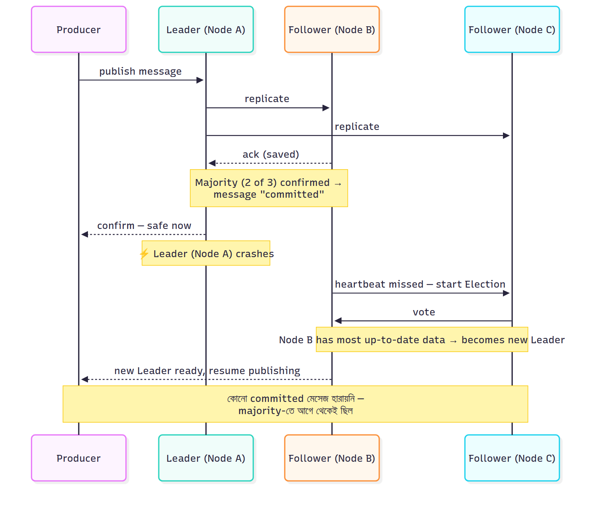

# High Availability — Cluster, Quorum Queue ও Raft

আরও বিস্তারিতভাবে বুঝিয়ে দিচ্ছি RabbitMQ-এর High Availability ব্যাপারটা।

### প্রথমে বুঝি সমস্যাটা কী

ধরুন আপনার একটামাত্র RabbitMQ সার্ভার (single node) চলছে। সেই সার্ভারটা যদি ক্র্যাশ করে (hardware fail, power outage, বা কেউ ভুল করে সার্ভার রিস্টার্ট দিলো), তাহলে:
- Queue-তে জমে থাকা সব মেসেজ হারিয়ে যেতে পারে
- Producer আর মেসেজ পাঠাতে পারবে না
- Consumer আর মেসেজ পড়তে পারবে না
- পুরো সিস্টেম সেই একটা সার্ভারের উপর নির্ভরশীল — এটাকে বলে **Single Point of Failure (SPOF)**

High Availability মানে হলো — এমন একটা ব্যবস্থা করা যাতে **একটা নোড ডাউন হলেও পুরো সিস্টেম চলতে থাকে, ডেটা হারায় না**।

### Cluster কীভাবে কাজ করে

RabbitMQ **Cluster** হলো একাধিক RabbitMQ নোড (সার্ভার) একসাথে যুক্ত করে একটা logical unit বানানো। যেমন ৩টা নোড (Node A, Node B, Node C) মিলে একটা cluster।

গুরুত্বপূর্ণ ব্যাপার: **Metadata (exchange, binding, user permission ইত্যাদি তথ্য) সব নোডে সবসময় sync হয়ে থাকে।** কিন্তু আসল মেসেজ ডেটা কোথায় থাকবে, সেটা নির্ভর করে আপনি কোন ধরনের Queue ব্যবহার করছেন তার উপর।

### Quorum Queue — বিস্তারিত

Quorum Queue হলো এমন এক ধরনের Queue যেখানে একটা Queue-এর ডেটা **একাধিক নোডে কপি (replica) হয়ে থাকে**। ধরুন ৩ নোডের cluster-এ একটা Quorum Queue বানালেন replication factor ৩ দিয়ে — তাহলে সেই Queue-এর একটা **leader** replica আর দুইটা **follower** replica থাকবে, প্রতিটা আলাদা নোডে।

#### Raft Consensus Algorithm — কীভাবে কাজ করে

এখানেই আসল ম্যাজিক। Raft হলো একটা algorithm যেটা নিশ্চিত করে সব replica-এর ডেটা **consistent** (একই রকম) থাকে।

**ধাপে ধাপে যা ঘটে:**

1. যখন একটা মেসেজ আসে, সেটা প্রথমে **Leader** replica-তে যায় (প্রতিটা Queue-এর একটাই leader থাকে)
2. Leader সেই মেসেজটা তার **Follower** replica গুলোর কাছে পাঠায়
3. **যখন majority (অর্ধেকের বেশি) follower** সেই মেসেজ নিজের কাছে সেভ করে ফেলার কনফার্মেশন পাঠায়, তখনই Leader ধরে নেয় মেসেজটা "committed" — মানে নিরাপদ
4. এরপরই Producer-কে জানানো হয় মেসেজ সফলভাবে গৃহীত হয়েছে

**কেন majority (অর্ধেকের বেশি) দরকার?** ৩ নোডের ক্ষেত্রে অন্তত ২টা নোডে (Leader + ১ Follower) ডেটা থাকলেই এটা "committed" ধরা হয়। এর মানে, ১টা নোড crash করলেও বাকি ২টাতে ডেটা আছে, তাই কিছু হারায় না।

### Leader Crash হলে কী হয়

এটাই সবচেয়ে গুরুত্বপূর্ণ অংশ। যদি Leader নোড হঠাৎ crash করে:

1. বাকি Follower নোডগুলো বুঝতে পারে Leader আর response দিচ্ছে না (heartbeat miss হচ্ছে)
2. Raft algorithm অনুযায়ী, বেঁচে থাকা নোডগুলোর মধ্যে একটা **নতুন Election** হয় — ভোটাভুটির মতো
3. যে নোডের কাছে সবচেয়ে **up-to-date ডেটা** আছে, সেটা নতুন Leader নির্বাচিত হয়
4. এই পুরো প্রক্রিয়াটা কয়েক সেকেন্ডের মধ্যেই শেষ হয়ে যায়, এবং Producer/Consumer নতুন Leader-এর সাথে আবার কানেক্ট করে কাজ চালিয়ে যায়

**গুরুত্বপূর্ণ**: যেহেতু নতুন Leader-এর কাছে already committed সব ডেটা আছে (majority replica-তে ছিল বলে), তাই কোনো মেসেজ হারায় না।

### Real World উদাহরণ

ধরুন একটা e-commerce কোম্পানি যাদের black Friday sale চলছে — হাজার হাজার অর্ডার প্রতি সেকেন্ডে আসছে। তাদের RabbitMQ যদি একটা মাত্র সার্ভারে চলে আর সেটা crash করে, পুরো sale-এর অর্ডার প্রসেসিং বন্ধ হয়ে যাবে — বিশাল রেভিনিউ লস।

এর বদলে তারা ৫ নোডের একটা cluster রাখে Quorum Queue দিয়ে। একটা নোডে hardware সমস্যা হলেও (যেমন disk fail), বাকি ৪টা নোড কাজ চালিয়ে যায় নিরবচ্ছিন্নভাবে — কাস্টমাররা কিছুই টের পায় না।

### একটা গুরুত্বপূর্ণ Trade-off (ইন্টারভিউতে জিজ্ঞেস করতে পারে)

Quorum Queue এর replication এর কারণে **write latency একটু বাড়ে** — কারণ প্রতিটা মেসেজ কমিট হওয়ার আগে majority নোডের কনফার্মেশন লাগে। অর্থাৎ **Availability আর Latency-এর মধ্যে একটা trade-off** থাকে — এটা একটা common interview follow-up প্রশ্ন, তাই মাথায় রাখা ভালো।

---

---

[⬅ 05-Message-Ordering.md](./05-Message-Ordering.md) | [07-Mirrored-Queue-Deprecated.md ➡](./07-Mirrored-Queue-Deprecated.md) | [🏠 Repo Home](../README.md)
