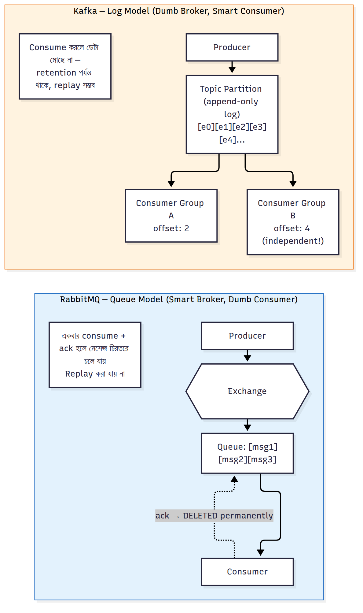

# RabbitMQ vs Kafka

RabbitMQ vs Kafka নিয়ে আরও গভীরে যাই — এটা একটা খুবই common এবং গুরুত্বপূর্ণ ইন্টারভিউ প্রশ্ন, তাই architecture-এর মূল পার্থক্যটা ভালোভাবে বুঝে নেওয়া দরকার।

### মূল আর্কিটেকচারাল পার্থক্য — এটাই আসল কারণ

#### RabbitMQ: Queue-based Model (Traditional Message Broker)

RabbitMQ-তে একটা মেসেজ যখন Queue-তে ঢোকে, এটা একটা **task হিসেবে ট্রিট হয়** — কেউ একজন সেটা নেবে, প্রসেস করবে, ack পাঠাবে, আর তারপর মেসেজটা **স্থায়ীভাবে মুছে যাবে**। এটা একবার consume হয়ে গেলে চিরতরে চলে যায়।

**এটা "Smart Broker, Dumb Consumer" মডেল** — মানে RabbitMQ নিজেই routing, priority, DLQ, retry এসবের জটিল লজিক হ্যান্ডেল করে, Consumer-এর কাজ শুধু মেসেজ নিয়ে process করা।

#### Kafka: Log-based Model (Distributed Log)

Kafka সম্পূর্ণ ভিন্নভাবে কাজ করে। এখানে মেসেজ (এটাকে বলে **event**) একটা **append-only log**-এ যোগ হয় — অনেকটা একটা খাতার মতো, যেখানে নতুন এন্ট্রি সবসময় শেষে যোগ হয়, আগের এন্ট্রি মোছা হয় না।

- প্রতিটা event-এর একটা **offset** (নাম্বার/position) থাকে
- Consumer নিজে ট্র্যাক রাখে সে কোন offset পর্যন্ত পড়েছে
- একই event **একাধিক independent Consumer Group** পড়তে পারে — একজন পড়ে ফেললেও মেসেজ মোছে না, তাই অন্যরাও পড়তে পারবে
- চাইলে offset পিছিয়ে দিয়ে **আগের ডেটা আবার replay** করা যায় (যেমন কোনো bug fix করার পর পুরনো ডেটা আবার প্রসেস করতে চাইলে)

**এটা "Dumb Broker, Smart Consumer" মডেল** — Kafka শুধু ডেটা store আর distribute করে, বাকি লজিক (কে কতটুকু পড়েছে, কীভাবে process করবে) Consumer নিজে সামলায়।

### কেন এই পার্থক্যটা Use Case নির্ধারণ করে

#### RabbitMQ কেন Payment/Order Processing-এর জন্য ভালো

1. **Exactly reflects task queue semantics**: একটা payment একবারই process হওয়া উচিত, একজন worker-ই সেটা নেবে — এটাই RabbitMQ-এর natural behavior
2. **Complex routing দরকার**: Priority queue (urgent payment আগে), DLQ (fail হলে আলাদা জায়গায়), TTL — এসব RabbitMQ-তে built-in এবং সহজ
3. **কম latency দরকার একটা single request-এর জন্য**: RabbitMQ push-based, তাই মেসেজ আসামাত্রই consumer-কে পাঠিয়ে দেয়

#### Kafka কেন Clickstream/Analytics-এর জন্য ভালো

1. **একই ডেটা multiple team ব্যবহার করে**: একটা user click event Analytics team, Fraud detection team, Recommendation team — সবাই আলাদাভাবে পড়বে। RabbitMQ-তে এটা করতে হলে Fanout exchange দিয়ে একই মেসেজ multiple Queue-তে কপি পাঠাতে হতো (storage duplicate হতো), Kafka-তে একই log সবাই শেয়ার করে
2. **বিশাল throughput**: Kafka disk-এ sequential write করে (অনেক দ্রুত), আর batching করে অনেক event একসাথে পাঠায় — তাই প্রতি সেকেন্ডে লক্ষ লক্ষ event handle করতে পারে
3. **Replay দরকার**: একটা নতুন ML model বানানোর সময় গত ৬ মাসের সব clickstream data আবার প্রসেস করতে চাইলে, Kafka থেকে সেই আগের offset থেকে আবার পড়া যায় — RabbitMQ-তে এটা সম্ভব না, কারণ মেসেজ already মুছে গেছে

### একটা Practical Comparison Table

| বিষয় | RabbitMQ | Kafka |
|---|---|---|
| মূল Use case | Task queue, RPC, complex routing | Event streaming, log aggregation |
| মেসেজ delete হয় কখন | Ack এর পর সাথে সাথে | Retention period (যেমন ৭ দিন) পর্যন্ত থাকে |
| Throughput | মাঝারি (হাজার-লক্ষ/সেকেন্ড) | অনেক বেশি (লক্ষ-কোটি/সেকেন্ড) |
| Replay করা যায় কি | না | হ্যাঁ, offset দিয়ে |
| Multiple consumer একই ডেটা পড়া | কঠিন (fanout দিয়ে duplicate করতে হয়) | Natural, built-in (consumer groups) |
| Priority/DLQ | Built-in সহজে | নিজে implement করতে হয় |
| Ordering | Per-queue (single consumer হলে) | Per-partition guaranteed |

### Real World: একই কোম্পানি দুটোই ব্যবহার করে

একটা বড় e-commerce কোম্পানি (Daraz টাইপ) সাধারণত **দুটোই একসাথে ব্যবহার করে**, কারণ তাদের দুই ধরনের প্রয়োজন আছে:

- **RabbitMQ**: অর্ডার placed হলে payment gateway-কে call করা, ইনভয়েস জেনারেট করা, SMS পাঠানো — এগুলো task-based, guaranteed exactly-once execution দরকার
- **Kafka**: ইউজার কোন প্রোডাক্ট দেখলো, কতক্ষণ দেখলো, কী সার্চ করলো — এই বিশাল পরিমাণ clickstream ডেটা সংগ্রহ করে Analytics, Recommendation Engine, আর Fraud Detection সিস্টেমে পাঠানো, যেখানে একই ডেটা একাধিক টিম আলাদাভাবে ব্যবহার করে

### Interview-এ যদি জিজ্ঞেস করে: "একটাই কেন বেছে নেবেন না?"

**সহজ উত্তর**: RabbitMQ দিয়ে Kafka-এর কাজ করতে গেলে (millions of events/sec, replay) সিস্টেম আটকে যাবে বা অস্বাভাবিক জটিল হয়ে যাবে। আবার Kafka দিয়ে simple task-queue কাজ (payment processing with priority+DLQ) করতে গেলে অনেক বেশি বাড়তি কোড লিখতে হবে, যেটা RabbitMQ-তে built-in সুবিধা হিসেবেই পাওয়া যায়। তাই **"right tool for the right job"** — এটাই আসল উত্তর।

---

---

[⬅ 07-Mirrored-Queue-Deprecated.md](./07-Mirrored-Queue-Deprecated.md) | [09-Real-World-Projects-Part1.md ➡](./09-Real-World-Projects-Part1.md) | [🏠 Repo Home](../README.md)
