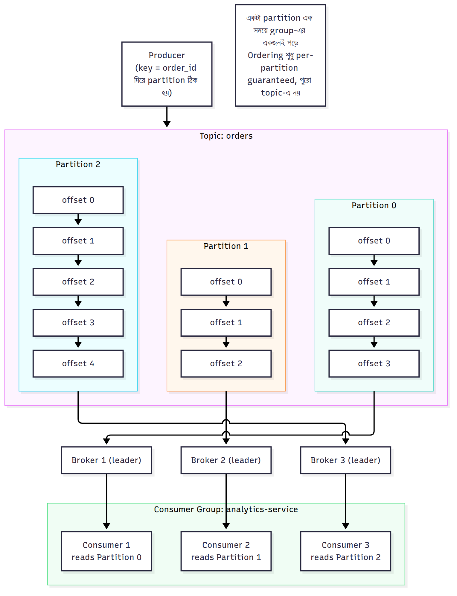

# ভেতরের মেকানিজম — Internals

আরও গভীরে যাই, একটা একটা করে Kafka-র ভেতরের মেকানিজম বুঝিয়ে দিচ্ছি।

### Topic ও Partition — কেন Partition-ই স্কেলিং-এর চাবি

একটা Topic হলো logical নাম; আসল ডেটা থাকে **Partition**-এ। ধরুন `orders` topic-এর ৪টা partition (P0, P1, P2, P3):

- প্রতিটা partition একটা স্বাধীন **ordered log** — নিজের offset sequence আছে
- একটা partition সবসময় **একটা broker**-এ leader হিসেবে থাকে (replica অন্য broker-এ)
- Consumer group-এ ৪টা consumer থাকলে প্রতিজন একটা করে partition পাবে → 4x parallelism
- Consumer সংখ্যা partition সংখ্যার বেশি হলে বাড়তি consumer **idle** বসে থাকবে — তাই **partition সংখ্যাই maximum parallelism নির্ধারণ করে**

**গুরুত্বপূর্ণ**: partition বাড়ানো যায় কিন্তু কমানো যায় না, আর partition বাড়ালে key→partition mapping বদলে যায় (ordering-এ প্রভাব পড়ে) — তাই শুরুতেই একটু বেশি partition রাখা common practice।

### Offset — প্রতিটা মেসেজের ঠিকানা

Offset হলো একটা partition-এর ভেতরে একটা event-এর position (0 থেকে শুরু)। এটা:
- **Partition-scoped** — P0-এর offset 5 আর P1-এর offset 5 সম্পূর্ণ আলাদা মেসেজ
- **Immutable ও ever-increasing** — একবার assign হলে বদলায় না
- Consumer-এর "bookmark" — কোন offset পর্যন্ত পড়া হয়েছে সেটাই commit হয়

তিন ধরনের offset মাথায় রাখুন: **log-start offset** (retention-এর পর পুরনো অংশ মুছলে এটা বাড়ে), **committed offset** (consumer কতদূর confirm করেছে), **log-end offset (LEO)** (সর্বশেষ লেখা মেসেজের পরের position)। **Consumer Lag = LEO − committed offset** — consumer কতটা পিছিয়ে আছে, monitoring-এর সবচেয়ে গুরুত্বপূর্ণ metric।

### Partition Key — কোন মেসেজ কোন Partition-এ

Producer প্রতিটা record-এ একটা **key** দিতে পারে। Kafka ঠিক করে record কোন partition-এ যাবে এভাবে:
- **Key থাকলে**: `partition = hash(key) % numPartitions` → **একই key সবসময় একই partition-এ** যায়
- **Key না থাকলে**: sticky/round-robin ভাবে partition-এ ছড়িয়ে দেয় (load balance, কিন্তু ordering guarantee নেই)

এই key-mechanism-ই ordering-এর চাবি: `orderId` বা `accountId` কে key বানালে সেই entity-র সব event একই partition-এ, একই order-এ থাকবে (সেকশন ৫ দ্রষ্টব্য)।

### Segment, Log ও কীভাবে Disk-এ থাকে

প্রতিটা partition disk-এ একগুচ্ছ **segment ফাইল** হিসেবে থাকে (যেমন প্রতি ১GB বা প্রতি সপ্তাহে নতুন segment)। Kafka এত দ্রুত কেন:
- **Sequential disk write** — log-এর শেষে append, random write নয় (disk-এ sequential অনেক দ্রুত)
- **Zero-copy** — disk থেকে network-এ সরাসরি পাঠায়, application memory-তে copy না করে (`sendfile`)
- **Page cache** — OS-এর page cache ব্যবহার করে, তাই recent ডেটা প্রায় RAM-speed-এ পড়া যায়
- **Batching + compression** — producer অনেক record একসাথে batch করে, compress করে পাঠায়

পুরনো segment retention policy অনুযায়ী পুরোটা মুছে ফেলা হয় (পুরো ফাইল delete — খুব সস্তা)।

### Replication, Leader/Follower, ISR

প্রতিটা partition-এর কয়েকটা **replica** থাকে (replication factor, যেমন ৩)। এদের মধ্যে একটা **Leader**, বাকিরা **Follower**:
- সব read/write **leader**-এর মাধ্যমে হয়
- Follower রা leader থেকে ডেটা fetch করে নিজেকে sync রাখে
- যেসব follower যথেষ্ট up-to-date, তারা **ISR (In-Sync Replicas)** সেটে থাকে
- Leader fail করলে **ISR থেকে একটা follower নতুন leader** হয় → কোনো committed ডেটা হারায় না

(বিস্তারিত সেকশন ৮-এ।)

### Controller — ZooKeeper বনাম KRaft

Cluster-এ একটা **Controller** থাকে যে partition leadership, replica assignment এসব ম্যানেজ করে:
- **পুরনো**: cluster metadata ও controller election **ZooKeeper** নামের আলাদা সিস্টেম সামলাতো
- **নতুন (KRaft mode)**: Kafka নিজেই Raft consensus দিয়ে metadata সামলায়, ZooKeeper আর লাগে না — সহজ deployment, দ্রুত failover, বেশি scalable (Kafka 3.3+ production-ready, 4.0-এ ZooKeeper বাদ)

### Producer acks, Retries, Idempotence

Producer-এর কয়েকটা গুরুত্বপূর্ণ সেটিং যা reliability ঠিক করে:
- **`acks=0`**: leader-এর confirmation-ও চায় না — দ্রুততম, কিন্তু মেসেজ হারাতে পারে
- **`acks=1`**: leader লিখলেই confirm — leader fail করলে (follower-এ পৌঁছানোর আগে) হারাতে পারে
- **`acks=all`**: ISR-এর সব replica লিখলে তবে confirm — সবচেয়ে নিরাপদ
- **`enable.idempotence=true`**: retry-র কারণে duplicate লেখা ঠেকায় (প্রতিটা producer-record-এ sequence number দিয়ে broker duplicate ধরে) — এটাই এখন default (সেকশন ৭)

---

---

[⬅ 03-How-It-Works-Flow.md](./03-How-It-Works-Flow.md) | [05-Message-Ordering.md ➡](./05-Message-Ordering.md) | [🏠 Repo Home](../README.md)
