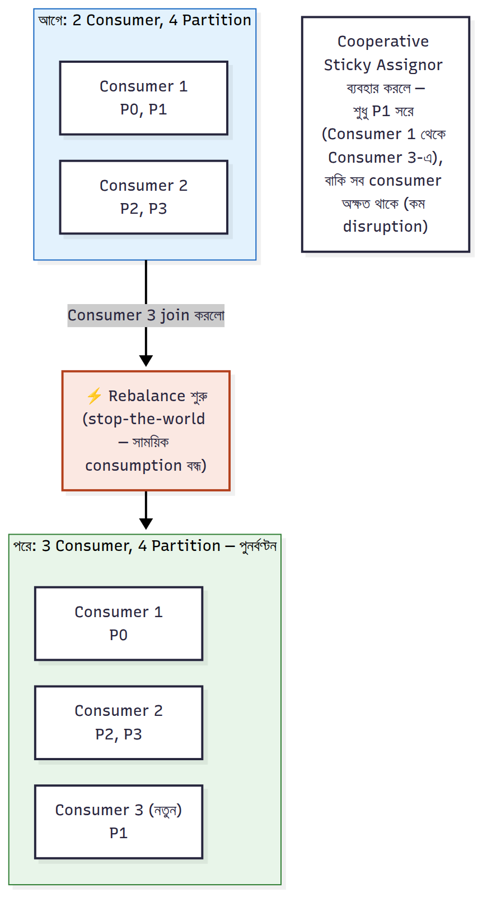

# Consumer Group ও Rebalancing


Consumer group Kafka-র সবচেয়ে গুরুত্বপূর্ণ scaling ধারণা — ভালো করে বুঝি।

### ৬.১ Consumer Group কী — Load ভাগ কীভাবে হয়

একটা **Consumer Group** হলো এক নামে (`group.id`) চলা কয়েকটা consumer, যারা মিলে একটা topic পড়ে। Kafka topic-এর partition-গুলো group-এর member-দের মধ্যে ভাগ করে দেয়:

- ৬ partition, ৩ consumer → প্রতিজন ২টা partition পায়
- ৬ partition, ৬ consumer → প্রতিজন ১টা (সর্বোচ্চ parallelism)
- ৬ partition, ৮ consumer → ৬ জন কাজ করে, ২ জন idle (partition-ই limit)

**মূল নিয়ম**: একটা partition একসাথে group-এর **একজনই** পড়ে (তাই ordering ঠিক থাকে)। কিন্তু **ভিন্ন consumer group একই partition independently** পড়তে পারে — এভাবেই একই ডেটা analytics, fraud, billing সবাই আলাদাভাবে পড়ে।

```js
// দুই আলাদা group একই topic পড়ছে — একে অপরকে প্রভাবিত করে না
const analytics = kafka.consumer({ groupId: 'analytics-group' });
const fraud     = kafka.consumer({ groupId: 'fraud-group' });
// প্রতিটা group নিজের offset আলাদা করে ট্র্যাক করে
```

### ৬.২ Rebalancing — Partition Assignment বদলানো



যখন group-এ consumer যোগ হয়/চলে যায় (crash, deploy, scale), Kafka partition-গুলো আবার ভাগ করে — একে **Rebalance** বলে:

1. একজন consumer মারা গেলে তার partition-গুলো বাকিদের মধ্যে ভাগ হয়ে যায়
2. নতুন consumer যোগ হলে তাকে কিছু partition দেওয়া হয়
3. Rebalance চলাকালীন **সংক্ষিপ্ত সময়ের জন্য consumption থামে** ("stop-the-world") — এটাই rebalance-এর মূল খরচ

Rebalance trigger হয়: consumer heartbeat মিস করলে (`session.timeout.ms`), `max.poll.interval.ms`-এর মধ্যে poll না করলে (process করতে বেশি সময় লাগলে), বা partition সংখ্যা বদলালে।

### ৬.৩ Offset Commit — Auto vs Manual

Consumer কতদূর পড়েছে তা `__consumer_offsets` topic-এ commit করে:

- **Auto-commit** (`enable.auto.commit=true`): প্রতি `auto.commit.interval.ms` (default 5s) পরপর নিজে থেকে commit করে। সহজ, কিন্তু ঝুঁকি — commit হয়ে গেছে কিন্তু process শেষ হয়নি এমন সময় crash করলে **মেসেজ হারায়** (at-most-once ঝুঁকি), বা উল্টো duplicate।
- **Manual commit** (`enable.auto.commit=false`): process **শেষ করার পর** নিজে commit করেন — production-এ recommended। এটাই at-least-once নিশ্চিত করে।

```js
const consumer = kafka.consumer({ groupId: 'orders-worker', });
await consumer.connect();
await consumer.subscribe({ topic: 'orders', fromBeginning: false });
await consumer.run({
  autoCommit: false,                          // manual — process শেষে commit
  eachMessage: async ({ topic, partition, message }) => {
    await handleOrder(JSON.parse(message.value.toString()));  // আগে কাজ
    await consumer.commitOffsets([{            // তারপর commit — at-least-once
      topic, partition, offset: (Number(message.offset) + 1).toString(),
    }]);
  },
});
```

> ⚠️ **নোট**: offset commit করার সময় `+1` করতে হয় — কারণ commit মানে "এই offset থেকে পরেরটা পড়া শুরু করবো", অর্থাৎ সর্বশেষ-পড়া offset + 1।

### ৬.৪ Sticky / Cooperative Rebalance ও Lag

- **Cooperative (Incremental) Rebalance**: পুরনো "stop-the-world" পদ্ধতিতে rebalance হলে সব partition ছেড়ে দিয়ে আবার নেওয়া হতো। Cooperative sticky assignor শুধু যেগুলো সরানো দরকার সেগুলো সরায় — downtime অনেক কম। নতুন version-এ এটাই recommended।
- **Consumer Lag**: `LEO − committed offset`। Lag বাড়তে থাকলে বুঝবেন consumer produce-এর গতি ধরতে পারছে না — তখন consumer/partition বাড়াতে হয়। এটাই production-এ সবচেয়ে গুরুত্বপূর্ণ alert।

---

---

[⬅ 05-Message-Ordering.md](./05-Message-Ordering.md) | [07-Delivery-Semantics.md ➡](./07-Delivery-Semantics.md) | [🏠 Repo Home](../README.md)
