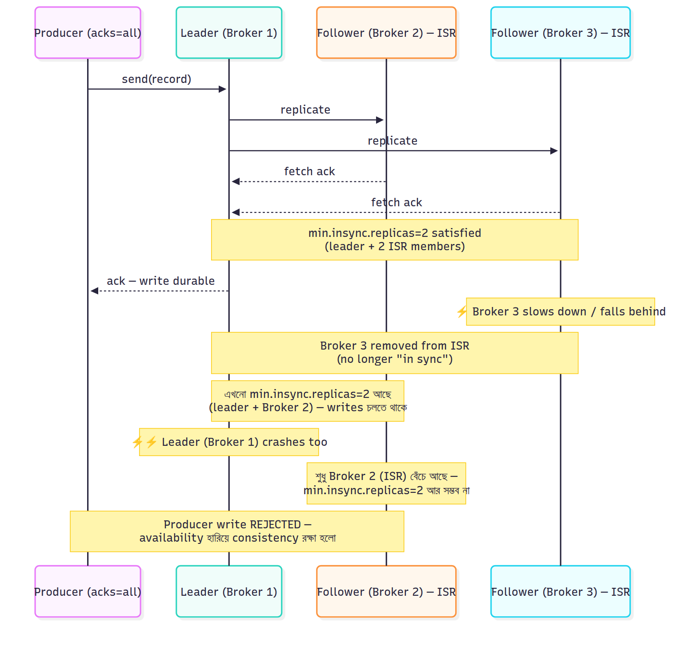

# High Availability — Replication, ISR, KRaft

Kafka কীভাবে একটা broker down হলেও ডেটা না হারিয়ে চলতে থাকে, বিস্তারিত বুঝি।

### ৮.১ Replication Factor ও Leader/Follower

প্রতিটা partition-কে কয়েক copy-তে রাখা হয় — **replication factor** (production-এ সাধারণত ৩)। ৩ broker-এর cluster-এ replication factor ৩ মানে:
- প্রতিটা partition-এর ১টা **Leader** + ২টা **Follower**, তিনটা আলাদা broker-এ
- সব read/write leader-এ হয়; follower রা leader থেকে fetch করে sync থাকে
- একটা broker down হলে সেই broker-এ থাকা leader partition-গুলোর জন্য অন্য broker-এর follower নতুন leader হয়

### ৮.২ ISR ও `min.insync.replicas`

**ISR (In-Sync Replicas)** = যেসব replica leader-এর সাথে যথেষ্ট up-to-date (নির্দিষ্ট সময়ের মধ্যে sync করেছে)। Slow/dead follower ISR থেকে বাদ পড়ে, আবার catch up করলে ফিরে আসে।

- **`acks=all`**: leader তখনই producer-কে confirm করে যখন **ISR-এর সব replica** মেসেজ লিখেছে
- **`min.insync.replicas=2`**: অন্তত ২টা replica in-sync না থাকলে producer write **reject** করবে (`acks=all`-এর সাথে)

এই দুটো একসাথে **durability-র চাবি**: replication factor 3 + `min.insync.replicas=2` + `acks=all` মানে — অন্তত ২ জায়গায় ডেটা না লেখা পর্যন্ত write সফল ধরা হবে না, তাই ১টা broker হারালেও ডেটা বাঁচে। (একটা trade-off: ২টার কম replica in-sync থাকলে availability হারিয়ে write বন্ধ হবে — consistency-কে অগ্রাধিকার।)

### ৮.৩ Broker Fail হলে কী হয় (Leader Election)

1. একটা broker crash করলো → তার হাতে থাকা leader partition-গুলো unavailable
2. **Controller** বুঝতে পারে, আর ISR থেকে একটা up-to-date follower-কে নতুন leader বানায়
3. Producer/Consumer metadata refresh করে নতুন leader-এর সাথে কাজ চালিয়ে যায় (client-এ built-in retry)
4. যেহেতু নতুন leader ISR-এ ছিল (committed ডেটা তার কাছে আছে), **কোনো committed মেসেজ হারায় না**

> ⚠️ **Unclean leader election**: যদি ISR-এর কোনো replica না বাঁচে আর `unclean.leader.election.enable=true` থাকে, তাহলে out-of-sync replica leader হতে পারে — কিছু ডেটা হারানোর বিনিময়ে availability ফিরে আসে। Production-এ সাধারণত এটা `false` রাখা হয় (data safety আগে)।

### ৮.৪ ZooKeeper → KRaft

- **আগে**: cluster metadata (কোন partition কোথায়, ISR কারা, controller কে) **ZooKeeper**-এ থাকতো — আলাদা একটা সিস্টেম maintain করতে হতো, বড় cluster-এ metadata bottleneck হতো
- **এখন (KRaft)**: Kafka নিজেই একটা internal Raft-based metadata log দিয়ে সব সামলায়। ফায়দা: এক সিস্টেম (deploy সহজ), দ্রুত controller failover, লক্ষ লক্ষ partition scale করা যায়। Kafka 3.3+ থেকে production-ready, 4.0-তে ZooKeeper সম্পূর্ণ বাদ।

---

---

[⬅ 07-Delivery-Semantics.md](./07-Delivery-Semantics.md) | [09-Retention-Compaction-Storage.md ➡](./09-Retention-Compaction-Storage.md) | [🏠 Repo Home](../README.md)
